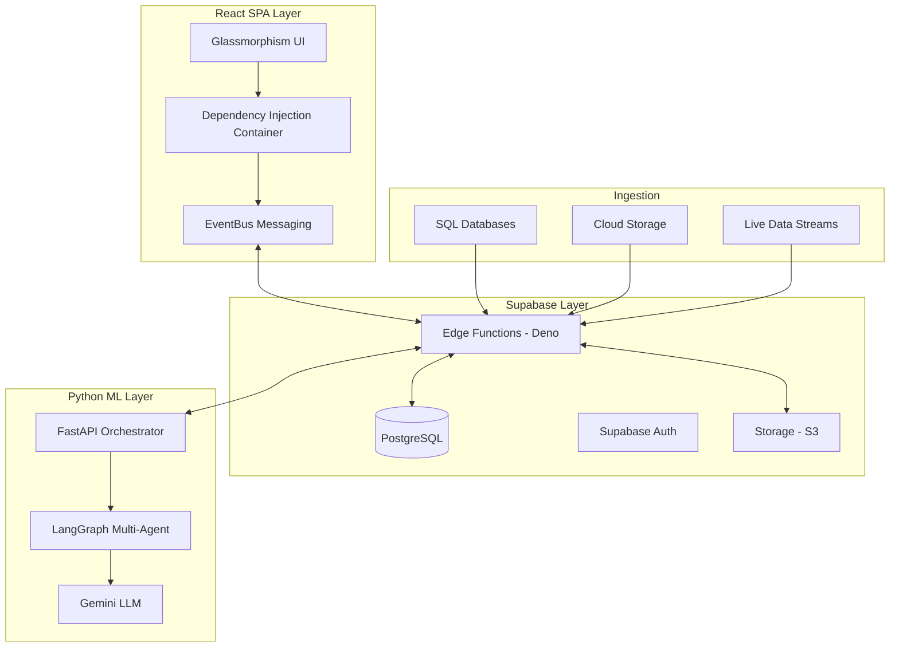

# DataIQ: AI-Powered Data Intelligence Platform

## Overview
DataIQ is a **Multi-Agent AutoML & Data Intelligence platform** built for high-performance data analysts and researchers. It automates the entire lifecycle of data—from raw ingestion to predictive modeling—using an AI-orchestrated system that handles data profiling, technical cleaning, and complex analytics through a unified, glassmorphism-inspired interface.

---

## 🏗️ System Architecture

---

## 🚀 Key Features (Inside the System)

### **1. Universal Data Ingestion Hub**
A central gateway to connect **20+ data sources**, including SQL Databases (Postgres, MySQL, Snowflake), Cloud Storage (Google Drive, OneDrive), and Live API Integrations.

### **2. AI-Orchestrated Analysis Notebooks**
A dynamic workspace where analysts interact with data using **LangGraph-powered AI agents**. Features Generative UI cells for charts, tables, and a visible "Reasoning" card revealing the AI's step-by-step logic.

### **3. Command Center (The Dashboard)**
A real-time operational hub featuring high-level **Metric Cards** (Usage, Capacity, Health), **Predictive Insight Cards**, and an automated **Activity Feed**.

### **4. AutoML Experiment Registry**
A framework for building, versioning, and deploying machine learning models. Manages the full pipeline: **Profiling -> Feature Engineering -> Training -> Evaluation -> Explanation**.

### **5. No-Code Automation Rules Engine**
An event-driven builder for custom workflows. Define **Triggers** (e.g., "Quality Spike") and **Actions** (e.g., "Export Report" or "Alert Stakeholder").

### **6. Privacy & Anonymization Pipeline**
A security-first module scanning datasets for **PII/PHI** and applying automated masking/anonymization protocols.

### **7. Live Data Stream Processor**
A specialized engine for handling real-time, high-frequency data telemetry for instant monitoring of fast-moving data.

### **8. Automated Report Generator**
Synthesizes complex findings into executive-ready **PDF, Markdown, or HTML reports** with interactive visuals.

---

## 🛠️ Core Services
- **AI Data Assistant**: Natural language database querying.
- **Predictive Bottleneck Analysis**: Early issue identification in datasets.
- **Cloud-Sync Service**: Continuous data synchronization.
- **Scheduled Audit Service**: Automated quality and schema-health checks.

---

## ⚙️ Configuration
> **Port Configuration Rule**
> - **Frontend**: Port 8080 (Vite)
> - **ML Service**: Port 8002 (FastAPI)
> *Ensure these ports are used to maintain service connectivity.*

